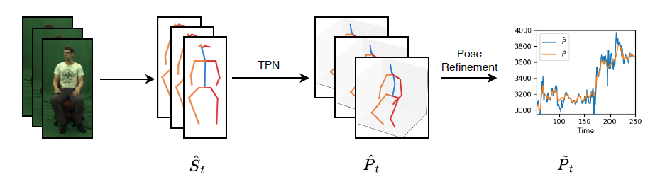

# Temporal Smoothing for 3D Human Pose Estimation and Localization for Occluded People
This repository contains the code for the paper "Temporal Smoothing for 3D Human Pose
Estimation and Localization for Occluded People" [link](https://arxiv.org/abs/2011.00250).



## Requirements

The code was tested with the following libraries:

- PyTorch 1.5.1
- numpy 1.16.4
- scipy 0.18.1

## Usage

### Preparations

First you have to download the preprocessed dataset from [here](https://drive.google.com/file/d/1OpIyGYyUi1bn8C9swV24iQofJVbTt1uq/view?usp=sharing) and unzip it in the root folder.  For evaluation, you also need to download the [MuPoTS](http://gvv.mpi-inf.mpg.de/projects/SingleShotMultiPerson/) dataset. For training, [MPII-3DHP](http://gvv.mpi-inf.mpg.de/3dhp-dataset/) is also needed. After extraction, the folder structure should look like this:

```
root
 +-- datasets
 |    +-- Mpi3DHP
 |    |    +-- mpi_inf_3dhp_test_set
 |    |    +-- S1
 |    |    ...
 |    +-- MucoTemp
 |    |    +-- frames
 |    |    +-- hrnet_keypoints
 |    +-- MuPoTS
 |         +-- hrnet_pose2d
 |         +-- MultiPersonTestSet
 +-- src
```

You can also download the pretrained models from [here](https://drive.google.com/file/d/1IXtjAiePbyNDHjWZ-VyFkTZlVdrnwJ7z/view?usp=sharing).

### Running

To evaluate the pretrained models, simply run the following command:

```bash
root_dir/src$ python3 scripts/eval.py -r normal
```

The `-r` switch controls whether to use pose refinement or not. In the paper, mm based metrics were calculated on a model using the 'normal' MPII coordinates, while 3DPCK was trained with 'universal' coordinates. If you want to evaluate the latter, use `universal` instead of `normal` in the command line above.

To train the model, use train.py. The parameters can be set in the script:

```bash
root_dir/src$ python3 scripts/train.py
```

After, to evaluate the model, use:

```bash
root_dir/src$ python3 scripts/eval.py -r ../output
```

### Muco-Temp

To save space, the frames of the MuCo-Temp dataset are not included, only the pregenerated 2D pose estimations. If you need the frames, you can use `generate_muco_temp.py` to recreate them. You'll need the MPII-3DHP dataset downloaded.

## Inference on videos

To run the model on videos, you have to get Detectron2 and HR-Net. The following script downloads them and creates a Conda environment with all the necessary dependencies:

```bash
(base) root_dir$ ./install_dependencies
```

You also need to download the [pretrained models](https://drive.google.com/file/d/1IXtjAiePbyNDHjWZ-VyFkTZlVdrnwJ7z/view?usp=sharing) and unzip them in the root directory. Once done, you can create predictions using the following command:

```
(base) root_dir$ conda activate pose-refinement
(pose-refinement) root_dir$ cd src
(pose-refinement) root_dir/src$ python scripts/predict.py -r video.mp4 output.pkl
```

The `-r` switch controls whether to use pose refinement or not. If you have the camera calibration parameters you can also provide them using the `-f`, `-cx/-cy` arguments.

## Citatation

```
@InProceedings{veges2020temporal,
  author="V{\'e}ges, M. and L{\H{o}}rincz, A.",
  title="Temporal Smoothing for 3D Human Pose Estimation and Localization for Occluded  People",
  booktitle="Neural Information Processing",
  year="2020",
  pages="557--568",
}
```

